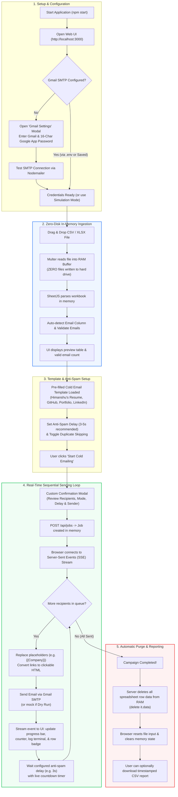

# Auto Cold Email Sender - Application Flowchart

This document details the architectural and execution flow of the **Auto Cold Email Sender** application.

```mermaid
flowchart TD
    %% Subgraph 1: User Configuration
    subgraph S1["1. Setup & Configuration"]
        A["Start Application (npm start)"] --> B["Open Web UI (http://localhost:3000)"]
        B --> C{"Gmail SMTP Configured?"}
        C -- "No" --> D["Open 'Gmail Settings' Modal<br/>Enter Gmail & 16-Char Google App Password"]
        D --> E["Test SMTP Connection via Nodemailer"]
        E --> F["Credentials Ready (or use Simulation Mode)"]
        C -- "Yes (via .env or Saved)" --> F
    end

    %% Subgraph 2: In-Memory Ingestion
    subgraph S2["2. Zero-Disk In-Memory Ingestion"]
        F --> G["Drag & Drop CSV / XLSX File"]
        G --> H["Multer reads file into RAM Buffer<br/>(ZERO files written to hard drive)"]
        H --> I["SheetJS parses workbook in memory"]
        I --> J["Auto-detect Email Column & Validate Emails"]
        J --> K["UI displays preview table & valid email count"]
    end

    %% Subgraph 3: Template & Rules
    subgraph S3["3. Template & Anti-Spam Setup"]
        K --> L["Pre-filled Cold Email Template Loaded<br/>(Himanshu's Resume, GitHub, Portfolio, LinkedIn)"]
        L --> M["Set Anti-Spam Delay (3-5s recommended)<br/>& Toggle Duplicate Skipping"]
        M --> N["User clicks 'Start Cold Emailing'"]
    end

    %% Subgraph 4: Execution & Real-Time SSE
    subgraph S4["4. Real-Time Sequential Sending Loop"]
        N --> O["Custom Confirmation Modal<br/>(Review Recipients, Mode, Delay & Sender)"]
        O --> P["POST /api/jobs -> Job created in memory"]
        P --> Q["Browser connects to Server-Sent Events (SSE) Stream"]
        Q --> R{"More recipients in queue?"}
        
        R -- "Yes" --> S["Replace placeholders (e.g. {{Company}})<br/>Convert links to clickable HTML"]
        S --> T["Send Email via Gmail SMTP<br/>(or mock if Dry Run)"]
        T --> U["Stream event to UI: update progress bar,<br/>counter, log terminal, & row badge"]
        U --> V["Wait configured anti-spam delay (e.g. 3s)<br/>with live countdown timer"]
        V --> R
    end

    %% Subgraph 5: Auto-Purge & Cleanup
    subgraph S5["5. Automatic Purge & Reporting"]
        R -- "No (All Sent)" --> W["Campaign Completed!"]
        W --> X["Server deletes all spreadsheet row data from RAM<br/>(delete it.data)"]
        X --> Y["Browser resets file input & clears memory state"]
        Y --> Z["User can optionally download timestamped CSV report"]
    end

    style S2 fill:#eff6ff,stroke:#3b82f6,stroke-width:2px
    style S4 fill:#f0fdf4,stroke:#22c55e,stroke-width:2px
    style S5 fill:#fef2f2,stroke:#ef4444,stroke-width:2px
```
